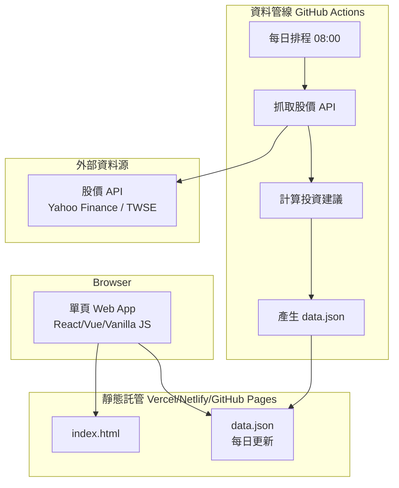
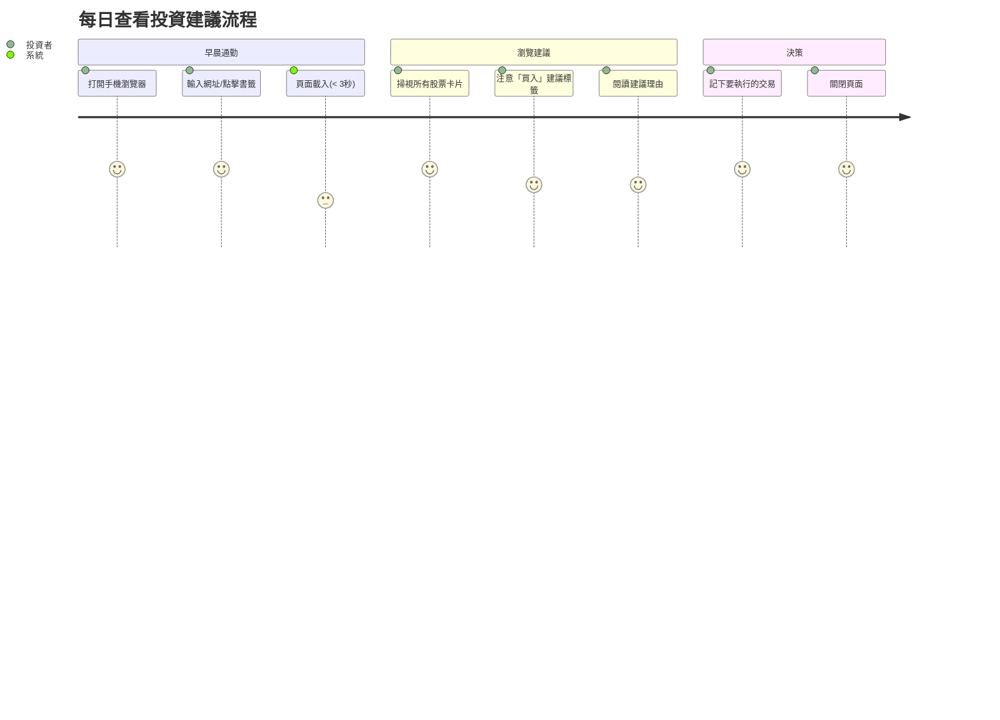
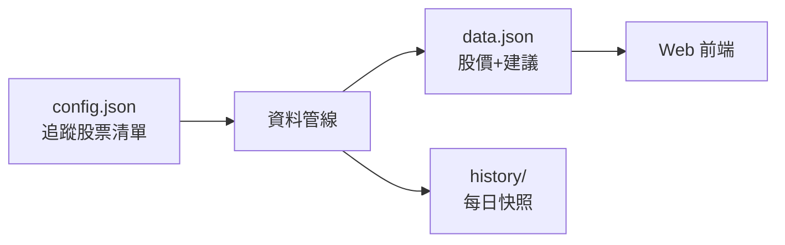
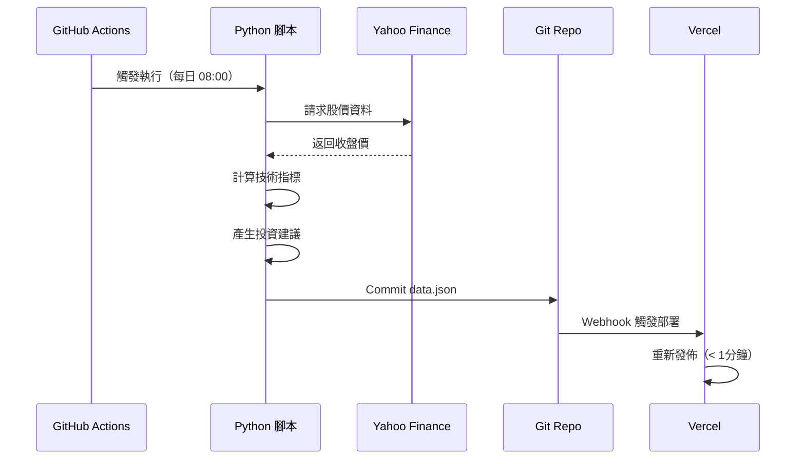
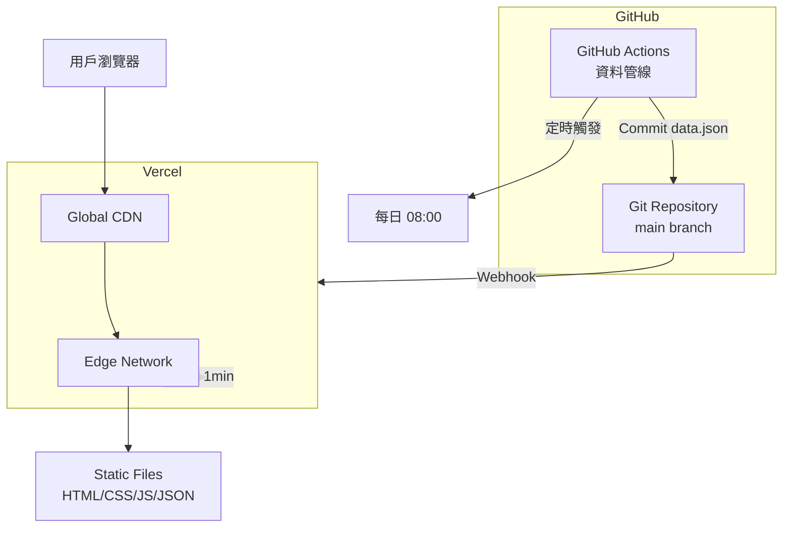

# 系統設計說明書（SDD）樣板 — Web 系統

本文檔提供以 SDD（Software Design Description）方式撰寫之完整結構與可填寫樣板，適用於「以網頁形式執行」之系統。直接在各節補齊內容即可作為正式規格書，並可配合 PR 審查與需求追蹤。

---

## 版本資訊與文件控管
- **文件名稱**：我的投資分析建議系統設計說明書（SDD）
- **版本**：v0.1.0
- **編寫日期**：2025-10-30
- **文件狀態**：Draft
- **文件擁有者/維護者**：Joe
- **變更紀錄**：
  - v0.1.0（2025-10-30）建立初版規格

---

## 執行摘要（Executive Summary）

### 系統概述
「我的投資分析建議」是一個輕量級個人投資輔助工具，以單頁 Web 應用形式呈現每日股票價格與自動產生的買賣建議。系統設計目標為**快速決策**、**行動優先**與**低維護成本**。

### 核心價值
- 🚀 **快速**：頁面載入 < 3 秒，打開即看到當日建議
- 📱 **行動友善**：響應式設計，手機/平板/桌面完美適配
- 🤖 **自動化**：每日 08:00 自動更新股價與建議，無需手動操作
- 💰 **低成本**：完全免費或 < 300 NTD/月，適合個人使用

### 技術亮點
- **無伺服器架構**：靜態檔案 + GitHub Actions，無需維護後端
- **極簡技術棧**：React/Vanilla JS + Python + JSON，易於維護
- **全球分發**：透過 Vercel CDN 快速存取

### 開發時程
- **MVP（2 週）**：基本股票展示 + 簡易建議 + RWD
- **M2（1 個月）**：擴充股票數量 + 進階技術指標
- **M3（2 個月）**：離線支援 + 監控優化

---

## 1. 簡介（Introduction）
1.1 目的（Purpose）
- 一頁式呈現當天股票狀況與投資建議(原因)
- RWD形式支援手機瀏覽

1.2 範疇（Scope）
- 打開畫面就可以看到當天股票狀況與投資建議。

1.3 背景與脈絡（Background）
-  股市、基金之投資建議。

1.4 名詞定義與縮寫（Definitions & Acronyms）
- 暫無

1.5 參考文件（References）
- 暫無。

---

## 2. 高階目標與非目標

### 核心目標
- **快速決策**：用戶打開頁面 3 秒內看到當日投資建議（TTFB < 500ms，FCP < 1.5s）
- **行動優先**：90% 使用場景來自手機，響應式設計支援 320px～1920px 寬度
- **資訊密度**：單頁呈現股票價格、漲跌、推薦動作與理由，無需滾動或點擊多頁
- **自動更新**：每個交易日自動抓取最新數據並產生建議（每日 08:00 更新）
- **可維護性**：單人維護，技術棧簡單、部署成本低（< 300 NTD/月）

### 非目標（本階段不做）
- ❌ 多用戶系統（無需登入/註冊）
- ❌ 即時報價（使用盤後收盤價）
- ❌ 交易執行（僅提供建議，不串接券商 API）
- ❌ 歷史回測與績效追蹤
- ❌ 社群/評論功能

---

## 3. 系統總覽（Overview）

### 3.1 高階架構圖


### 3.2 邏輯分層與職責

#### 前端層（UI）
- **技術選型**：輕量框架（Vite + React 或 Vanilla JS）
- **職責**：
  - 讀取 `data.json` 並渲染卡片式介面
  - RWD 自適應（手機優先，平板/桌面適配）
  - 顯示股票代號、名稱、收盤價、漲跌幅、投資建議（買/賣/持有）與理由
  - 無狀態管理（純展示，無互動表單）

#### 資料層（Static JSON）
- **格式**：`data.json` 存放所有當日股票資料與建議
- **更新機制**：由 CI/CD 管線每日覆寫
- **CDN 快取**：透過靜態託管自動分發，全球低延遲

#### 資料管線層（ETL）
- **觸發**：GitHub Actions cron schedule（每日 08:00 UTC+8）
- **流程**：
  1. 呼叫股價 API 取得昨日收盤價
  2. 執行演算法（技術指標、基本面篩選）
  3. 產生投資建議與理由文字
  4. 寫入 `data.json` 並 commit 到 repo
  5. 觸發靜態網站重新部署
- **語言**：Python（pandas、yfinance、requests）

#### 外部整合
- **股價資料源**：Yahoo Finance API 或台灣證交所公開資料
- **備援策略**：主要來源失敗時切換備用 API

---

## 4. 使用情境與用例（User Journeys & Use Cases）

### 4.1 使用者角色（Personas/Roles）
- **個人投資者（自己）**：每日早晨透過手機查看投資建議，作為當日交易參考

### 4.2 使用者旅程（User Journey）


### 4.3 用例規格

#### UC-001：查看當日投資建議
- **ID**：UC-001
- **名稱**：查看當日股票投資建議
- **角色**：投資者（自己）
- **前置條件**：
  - 資料管線已於當日 08:00 更新 `data.json`
  - 瀏覽器支援 ES6+（Chrome/Safari/Firefox 最近三版）
- **主要流程**：
  1. 用戶在手機/電腦開啟網址（例：`https://my-stocks.vercel.app`）
  2. 系統載入 HTML 與 `data.json`（< 3 秒）
  3. 系統渲染股票卡片列表，依建議類型排序（買入 > 持有 > 賣出）
  4. 每張卡片顯示：
     - 股票代號 + 名稱（例：2330 台積電）
     - 收盤價 + 漲跌幅（紅漲綠跌）
     - 投資建議標籤（🟢 買入 / 🟡 持有 / 🔴 賣出）
     - 理由摘要（1～2 句話）
  5. 用戶滑動瀏覽所有股票（垂直滾動）
- **替代/例外流程**：
  - **A1**：當日無更新資料 → 顯示「資料更新中，請稍後」提示
  - **E1**：`data.json` 載入失敗 → 顯示錯誤訊息與重試按鈕
  - **E2**：網路斷線 → 顯示 Service Worker 快取的前一日資料（標註日期）
- **後置條件/成功標準**：
  - 用戶能在 5 秒內理解今日投資重點
  - 手機瀏覽體驗流暢（無橫向滾動、字體可讀性 ≥ 14px）

---

## 5. 功能規格（Functional Specification）

### FEAT-001：股票資料展示
- **敘述**：As a 投資者, I want to 看到所有追蹤股票的最新價格與漲跌, so that 我能快速掌握市場動態
- **業務規則**：
  1. 顯示股票清單（可設定追蹤清單，初期手動設定於 config）
  2. 每檔股票顯示：代號、名稱、收盤價、漲跌幅（%）、成交量
  3. 漲跌幅以顏色區分：紅色（> 0）、綠色（< 0）、灰色（= 0）
  4. 資料來源：Yahoo Finance 或台灣證交所
- **前端畫面/互動**：
  - 卡片式佈局（Grid/Flex），手機單欄、平板雙欄、桌面三欄
  - 載入狀態：骨架屏（Skeleton）
  - 錯誤狀態：顯示錯誤圖示與重試按鈕
- **資料來源**：`data.json`
- **驗收標準**：
  - ✅ 手機瀏覽時卡片寬度 100%，無橫向滾動
  - ✅ 收盤價精確到小數點後 2 位
  - ✅ 漲跌幅顏色正確（紅漲綠跌）
  - ✅ 載入時間 < 3 秒（4G 網路）

---

### FEAT-002：投資建議產生
- **敘述**：As a 投資者, I want to 看到系統根據技術指標產生的買賣建議, so that 我能輔助交易決策
- **業務規則**：
  1. 建議類型：🟢 買入、🟡 持有、🔴 賣出
  2. 演算法邏輯（初版簡化）：
     - **買入**：5 日均線 > 20 日均線 且 RSI < 30（超賣）
     - **賣出**：5 日均線 < 20 日均線 且 RSI > 70（超買）
     - **持有**：其他情況
  3. 理由生成：模板化文字（例：「5MA 黃金交叉，RSI 低於 30，建議逢低買進」）
- **後端處理**（資料管線）：
  - Python 腳本計算技術指標（使用 `ta-lib` 或 `pandas_ta`）
  - 產生 JSON 格式：`{"symbol": "2330", "action": "buy", "reason": "..."}`
- **事件/排程**：
  - GitHub Actions cron：每日 08:00（`0 0 * * 1-5` UTC+0 = 08:00 UTC+8）
  - 假日跳過執行（台灣交易日曆）
- **驗收標準**：
  - ✅ 建議標籤顯眼（使用 Emoji 或顏色標籤）
  - ✅ 理由文字清晰（中文，< 50 字）
  - ✅ 排程準時執行（容忍度 ±5 分鐘）

---

### FEAT-003：響應式設計（RWD）
- **敘述**：As a 手機用戶, I want to 網頁自動適配螢幕大小, so that 我能舒適瀏覽
- **業務規則**：
  1. 支援斷點：
     - 手機（< 640px）：單欄佈局
     - 平板（640px～1024px）：雙欄佈局
     - 桌面（> 1024px）：三欄佈局
  2. 字體可讀性：最小字體 14px（手機）、16px（桌面）
  3. 觸控友善：按鈕/連結最小觸控區域 44x44px
- **前端畫面/互動**：
  - 使用 CSS Grid 或 Flexbox
  - Media Query 設定斷點
  - Viewport meta tag：`<meta name="viewport" content="width=device-width, initial-scale=1">`
- **驗收標準**：
  - ✅ iPhone SE（375px）正常顯示
  - ✅ iPad（768px）雙欄對齊
  - ✅ 1920px 桌面畫面置中，不過度拉伸

---

### FEAT-004：資料更新機制
- **敘述**：As a 系統, I want to 每日自動更新股價與建議, so that 用戶看到最新資訊
- **業務規則**：
  1. 排程：每週一至五 08:00（台灣時間）
  2. 資料來源：Yahoo Finance API（`yfinance` Python 套件）
  3. 更新流程：
     - 抓取前一交易日收盤價
     - 計算技術指標
     - 產生 `data.json`
     - Commit 到 Git repo
     - 觸發 Vercel 重新部署（< 1 分鐘）
- **事件/排程**：
  - GitHub Actions workflow：`.github/workflows/update-data.yml`
  - 環境變數：無需密鑰（使用公開 API）
- **驗收標準**：
  - ✅ 每日 08:10 前更新完成
  - ✅ 資料正確性：收盤價與證交所一致
  - ✅ 失敗通知：Slack/Email 告警（可選）

---

## 6. 介面設計（Interfaces）

### 6.1 前端 UI/UX 部分

#### 頁面路由
- **單頁應用**：`/` （首頁，展示所有股票）
- **無需多頁導覽**（未來可擴充：`/about`、`/settings`）

#### 資訊架構
```
頁面標題：我的投資建議 💰
  ├─ 更新時間標籤（例：2025-10-30 08:00 更新）
  ├─ 股票卡片列表（依建議排序：買入 → 持有 → 賣出）
  │   ├─ 股票代號 + 名稱（2330 台積電）
  │   ├─ 收盤價 + 漲跌幅（580 ▲ +2.5%）
  │   ├─ 建議標籤（🟢 買入 / 🟡 持有 / 🔴 賣出）
  │   └─ 理由摘要（5MA 黃金交叉，RSI 低檔反彈）
  └─ 頁尾（資料來源聲明、免責聲明）
```

#### 元件清單與狀態
| 元件 | Loading | Empty | Error | Success |
|------|---------|-------|-------|---------|
| 股票卡片 | 骨架屏（3個灰色區塊） | 顯示「無追蹤股票」 | 錯誤圖示 + 重試按鈕 | 完整資料 |
| 更新時間 | `載入中...` | - | `更新失敗` | `2025-10-30 08:00` |

#### 響應式斷點
- **Mobile**（< 640px）：單欄、字體 14px、卡片間距 12px
- **Tablet**（640px～1024px）：雙欄、字體 15px、卡片間距 16px
- **Desktop**（> 1024px）：三欄、字體 16px、卡片間距 20px、最大寬度 1200px 置中

#### 無障礙（A11y）
- 語意化 HTML（`<main>`, `<article>`, `<section>`）
- 顏色對比 WCAG AA（前景/背景對比 ≥ 4.5:1）
- 鍵盤操作：無互動元件，純展示頁面（未來按鈕需支援 Tab 導覽）

---

### 6.2 資料合約（靜態 JSON）

#### data.json 結構
```json
{
  "updatedAt": "2025-10-30T08:00:00+08:00",
  "stocks": [
    {
      "symbol": "2330",
      "name": "台積電",
      "price": 580.00,
      "change": 14.00,
      "changePercent": 2.48,
      "volume": 23456789,
      "recommendation": {
        "action": "buy",
        "reason": "5日均線黃金交叉20日均線，RSI指標為28顯示超賣，建議逢低買進",
        "confidence": 0.75
      }
    },
    {
      "symbol": "2317",
      "name": "鴻海",
      "price": 105.50,
      "change": -1.50,
      "changePercent": -1.40,
      "volume": 45678901,
      "recommendation": {
        "action": "hold",
        "reason": "價格持穩於均線附近，成交量平穩，建議續抱觀察",
        "confidence": 0.60
      }
    }
  ]
}
```

#### 欄位說明
| 欄位 | 型別 | 說明 | 範例 |
|------|------|------|------|
| `updatedAt` | ISO 8601 DateTime | 資料更新時間 | `2025-10-30T08:00:00+08:00` |
| `stocks` | Array | 股票清單 | - |
| `stocks[].symbol` | String | 股票代號 | `"2330"` |
| `stocks[].name` | String | 股票名稱 | `"台積電"` |
| `stocks[].price` | Number | 收盤價 | `580.00` |
| `stocks[].change` | Number | 漲跌金額 | `14.00` |
| `stocks[].changePercent` | Number | 漲跌幅 | `2.48` |
| `stocks[].volume` | Number | 成交量 | `23456789` |
| `stocks[].recommendation.action` | Enum | 建議動作 | `"buy"` / `"hold"` / `"sell"` |
| `stocks[].recommendation.reason` | String | 建議理由 | `"5MA黃金交叉..."` |
| `stocks[].recommendation.confidence` | Number | 信心度 (0~1) | `0.75` |

---

### 6.3 第三方整合

#### Yahoo Finance API（透過 yfinance 套件）
- **用途**：取得台股每日收盤價
- **呼叫方式**：
  ```python
  import yfinance as yf
  ticker = yf.Ticker("2330.TW")
  data = ticker.history(period="3mo")  # 取得近3個月資料
  ```
- **速率限制**：無正式限制，建議每分鐘 < 60 次
- **錯誤處理**：
  - 連線逾時：重試 3 次（指數退避）
  - 股票代號不存在：記錄錯誤，跳過該檔股票
  - API 維護：使用前一日快取資料

#### 台灣證交所公開資料（備援方案）
- **端點**：`https://www.twse.com.tw/exchangeReport/STOCK_DAY?stockNo=2330`
- **格式**：JSON
- **用途**：Yahoo Finance 失效時的備援資料源

---

## 7. 資料設計（Data Design）

### 7.1 資料架構概覽

本系統採用 **檔案式資料儲存**，無需資料庫，所有資料以靜態 JSON 檔案形式存在。



---

### 7.2 檔案定義

#### config.json（系統設定檔）
```json
{
  "watchlist": [
    "2330.TW",
    "2317.TW", 
    "2454.TW"
  ],
  "indicators": {
    "sma_short": 5,
    "sma_long": 20,
    "rsi_period": 14,
    "rsi_oversold": 30,
    "rsi_overbought": 70
  },
  "schedule": {
    "timezone": "Asia/Taipei",
    "updateTime": "08:00"
  }
}
```

**欄位說明**：
- `watchlist`：追蹤股票代號清單（Yahoo Finance 格式，`.TW` 後綴）
- `indicators`：技術指標參數
  - `sma_short/long`：短期/長期均線週期
  - `rsi_period`：RSI 計算週期
  - `rsi_oversold/overbought`：超賣/超買閾值
- `schedule`：排程設定

---

#### data.json（當日展示資料）
詳見 **6.2 資料合約** 章節。

**儲存位置**：`/public/data.json`（靜態託管根目錄）  
**更新頻率**：每日一次  
**版本控制**：Git 追蹤，可回溯歷史

---

#### history/ 目錄（歷史快照，可選）
```
history/
  ├── 2025-10-28.json
  ├── 2025-10-29.json
  └── 2025-10-30.json
```

**用途**：
- 保存每日資料快照（未來可做回測/趨勢分析）
- 格式與 `data.json` 相同
- **保留策略**：保留近 90 天（Git LFS 或單獨 S3 儲存）

---

### 7.3 資料流與一致性

#### 資料更新流程


#### 資料一致性保證
- **原子性**：單一 commit 包含完整 `data.json`（不會部分更新）
- **冪等性**：同一天重複執行產生相同結果
- **錯誤回滾**：若資料抓取失敗，保留前一版本（不 commit 空檔案）

---

### 7.4 資料保留與隱私

#### 資料保留
- **data.json**：永久保留（輕量檔案 < 100KB）
- **history/**：保留 90 天，超過後歸檔或刪除
- **無個人資料**：系統無用戶註冊，無 PII（Personally Identifiable Information）

#### 資料安全
- **傳輸加密**：HTTPS（由靜態託管服務自動提供）
- **存取控制**：公開讀取（無敏感資訊）
- **備份策略**：Git 作為版本控制，推送到 GitHub（自動備份）

---

## 8. 安全與存取控制（Security）

### 8.1 身分驗證與授權
- **無需驗證**：系統無登入機制（公開資訊展示）
- **未來擴充**：若需私密化，可使用 Vercel Password Protection 或 Cloudflare Access

---

### 8.2 安全基線

#### 傳輸安全
- **HTTPS**：由 Vercel/Netlify 自動提供 TLS 1.3 證書
- **HSTS**：啟用 HTTP Strict Transport Security（`Strict-Transport-Security: max-age=31536000`）

#### 前端安全
- **CSP（Content Security Policy）**：
  ```
  Content-Security-Policy: 
    default-src 'self'; 
    script-src 'self' 'unsafe-inline'; 
    style-src 'self' 'unsafe-inline'; 
    img-src 'self' data:;
  ```
- **防 XSS**：使用框架內建防護（React/Vue 自動跳脫）
- **無表單輸入**：無 CSRF 風險（純展示頁面）

#### 依賴管理
- **SCA 掃描**：使用 `npm audit` 或 Snyk 定期檢查套件弱點
- **自動更新**：Dependabot 啟用（每週檢查更新）

---

### 8.3 資料安全
- **無敏感資料**：展示公開市場資訊，無個人隱私
- **API Key 管理**：
  - Yahoo Finance 無需 API Key
  - 若使用付費 API，密鑰存於 GitHub Secrets（環境變數注入）

---

### 8.4 稽核與監控
- **GitHub Actions 日誌**：保留 90 天執行記錄
- **錯誤追蹤**：Sentry（可選）捕捉前端錯誤
- **存取日誌**：Vercel Analytics 記錄訪問量與地理分佈

---

### 8.5 合規聲明
- **免責聲明**：頁尾顯示「本系統僅供參考，投資風險自負」
- **資料來源聲明**：標註「資料來源：Yahoo Finance」
- **無 GDPR 要求**：不收集用戶資料，無 Cookie 橫幅需求

---

## 9. 非功能需求（NFRs）

### 9.1 性能需求

| 指標 | 目標 | 量測方式 |
|------|------|----------|
| **TTFB**（Time to First Byte） | < 500ms | Lighthouse / Vercel Analytics |
| **FCP**（First Contentful Paint） | < 1.5s | Lighthouse |
| **LCP**（Largest Contentful Paint） | < 2.5s | Lighthouse |
| **頁面大小** | < 500KB（含 data.json） | Network tab |
| **data.json 載入** | < 200ms | Fetch API timing |

**快取策略**：
- **靜態資源**：HTML/CSS/JS 使用 CDN 快取（Cache-Control: max-age=3600）
- **data.json**：短期快取（Cache-Control: max-age=300, must-revalidate）
- **Service Worker**（可選）：離線時顯示前一日資料

---

### 9.2 可靠性與可用性

#### SLO（Service Level Objectives）
- **可用性**：99.5%/月（靜態託管服務 SLA）
- **資料更新成功率**：98%（允許偶發 API 失敗）
- **錯誤率**：< 1%（前端 JS 錯誤）

#### 降級策略
- **資料源失敗**：顯示前一日快取資料 + 提示訊息
- **網路斷線**：Service Worker 提供離線存取
- **部署失敗**：Vercel 自動回滾到上一版本

---

### 9.3 可擴充性

#### 水平擴展
- **前端**：靜態檔案自動分發到 CDN（全球節點）
- **資料管線**：GitHub Actions 自動擴展（無需手動調整）

#### 未來擴充點
- 支援多幣別股票（美股、港股）
- 新增技術指標（KD、MACD）
- 即時 WebSocket 推播（需改架構）

---

### 9.4 可維運性

#### 可觀測性
- **前端監控**：Vercel Analytics（流量、國家、裝置）
- **錯誤追蹤**：Sentry 捕捉 JS 異常（可選）
- **管線監控**：GitHub Actions 失敗通知（Email）

#### 設定驅動
- **追蹤清單**：`config.json` 手動編輯（未來可做 Web UI）
- **技術指標參數**：可調整無需改 code

#### Runbook（運維手冊，簡化版）
| 情境 | 排查步驟 | 解決方案 |
|------|----------|----------|
| 資料未更新 | 1. 檢查 GitHub Actions 執行狀態 | 手動觸發 workflow |
| 股價錯誤 | 2. 對比 Yahoo Finance 原始資料 | 修正代號或切換資料源 |
| 頁面載入慢 | 3. Lighthouse 跑分 | 壓縮圖片/啟用 Gzip |

---

### 9.5 可近用性（Accessibility）

- **WCAG 2.1 AA 標準**：
  - ✅ 顏色對比 ≥ 4.5:1
  - ✅ 語意化 HTML 標籤
  - ✅ 響應式字體（最小 14px）
- **鍵盤操作**：目前無互動元件（純展示）
- **螢幕報讀器**：`<title>` 與 `<meta description>` 正確設定

---

### 9.6 在地化（i18n）

- **語言**：繁體中文（台灣）
- **時區**：Asia/Taipei（UTC+8）
- **數字格式**：千分位逗號（例：1,234.56）
- **日期格式**：YYYY-MM-DD HH:mm

---

## 10. 例外與錯誤處理（Errors & Exceptions）
10.1 錯誤碼表（模板）
- 4xx：VALIDATION_ERROR、UNAUTHORIZED、FORBIDDEN、RATE_LIMITED
- 5xx：INTERNAL_ERROR、UPSTREAM_TIMEOUT、DB_UNAVAILABLE
- 欄位：代碼、HTTP 狀態、訊息、排查建議、是否可重試。

10.2 超時與重試
- 後端對外呼叫超時（例：2s），重試策略（退避、冪等保證）。

---

## 11. 設定與功能旗標（Config & Feature Flags）
- 環境變數命名規則與載入順序（.env → KMS/Secrets Manager）。
- 旗標：開關、受眾、風險、回退方案。

---

## 12. 部署與環境（Deployment & Environments）

### 12.1 環境配置

#### 單一環境策略（Production Only）
- **簡化原因**：個人專案、無多用戶、快速迭代
- **環境**：`main` 分支 = Production
- **測試**：本機開發 + GitHub Actions 驗證 → 直接部署

#### 未來擴充（可選 Staging）
- `develop` 分支 → Vercel Preview URL
- `main` 分支 → Production Domain

---

### 12.2 部署拓撲



---

### 12.3 CI/CD 管線

#### 前端部署流程（Vercel）
```yaml
# .github/workflows/deploy.yml（可選，Vercel 自動部署）
name: Deploy to Production
on:
  push:
    branches: [main]

jobs:
  deploy:
    runs-on: ubuntu-latest
    steps:
      - uses: actions/checkout@v3
      - uses: actions/setup-node@v3
        with:
          node-version: 18
      - run: npm ci
      - run: npm run build
      - run: npm test
      # Vercel CLI 部署（或使用 Vercel Git Integration）
```

**部署策略**：
- **觸發**：Push to `main` 或手動觸發
- **建置時間**：< 2 分鐘
- **部署方式**：原子性替換（無停機時間）
- **回滾**：Vercel Dashboard 一鍵回滾到前一版

---

#### 資料更新管線（GitHub Actions）
```yaml
# .github/workflows/update-data.yml
name: Update Stock Data
on:
  schedule:
    - cron: '0 0 * * 1-5'  # 每週一至五 08:00 (UTC+8)
  workflow_dispatch:  # 允許手動觸發

jobs:
  update:
    runs-on: ubuntu-latest
    steps:
      - uses: actions/checkout@v3
      
      - name: Setup Python
        uses: actions/setup-python@v4
        with:
          python-version: '3.11'
      
      - name: Install dependencies
        run: |
          pip install yfinance pandas pandas-ta
      
      - name: Fetch stock data & generate recommendations
        run: python scripts/update_data.py
      
      - name: Commit & Push
        run: |
          git config user.name "GitHub Actions"
          git config user.email "actions@github.com"
          git add public/data.json history/
          git commit -m "chore: update stock data [skip ci]"
          git push
```

**執行流程**：
1. 定時觸發（每日 08:00）
2. 執行 Python 腳本抓取股價
3. 計算技術指標與建議
4. Commit `data.json` 到 Git
5. 觸發 Vercel 重新部署（< 1 分鐘）

**失敗處理**：
- API 錯誤：重試 3 次，失敗則發送 Email 通知
- 資料驗證失敗：不 commit（保留前一版本）

---

### 12.4 域名與 SSL

- **域名**（可選）：`my-stocks.vercel.app`（免費）或自訂域名
- **SSL 證書**：Vercel 自動提供（Let's Encrypt）
- **DNS 設定**：CNAME 指向 Vercel（若使用自訂域名）

---

### 12.5 部署檢查清單

#### 部署前
- [ ] 執行 `npm run build` 無錯誤
- [ ] 測試 `data.json` 格式正確（JSON Schema 驗證）
- [ ] 檢查 Lighthouse 分數（Performance > 90）

#### 部署後
- [ ] 驗證首頁載入正常（手機/桌面）
- [ ] 檢查更新時間是否為最新
- [ ] 測試斷網時離線存取（若有 Service Worker）

---

## 13. 日誌與可觀測性（Observability）
- Logging：結構化日誌格式、遮罩敏感資訊、保留期。
- Metrics：關鍵業務/系統指標（QPS、錯誤率、延遲），SLO 對應。
- Tracing：端對端追蹤，取樣率設定。
- 警報：門檻、抑制、排班、Runbook 連結。

---

## 14. 測試策略（Testing Strategy）

### 14.1 測試金字塔（簡化版）

```
      /\
     /E2E\    Playwright（1～2 條關鍵路徑）
    /------\
   /整合測試\  Python 腳本單元測試（資料抓取）
  /----------\
 / 靜態分析   \ ESLint, Prettier, TypeCheck
/--------------\
```

---

### 14.2 測試分層

#### 前端測試
- **靜態分析**：
  - ESLint（偵測語法錯誤）
  - Prettier（統一格式）
- **單元測試**（可選）：
  - 工具：Vitest / Jest
  - 範圍：資料格式化函式（日期、金額、百分比）
- **端對端測試**（關鍵路徑）：
  - 工具：Playwright
  - 測試案例：
    - ✅ 頁面載入成功（200 狀態碼）
    - ✅ data.json 讀取並渲染卡片
    - ✅ 手機/桌面斷點正常切換

#### 資料管線測試
- **單元測試**：
  ```python
  # tests/test_indicators.py
  def test_calculate_sma():
      prices = [100, 102, 101, 103, 105]
      sma = calculate_sma(prices, period=5)
      assert sma == 102.2
  
  def test_generate_recommendation():
      data = {"sma5": 110, "sma20": 100, "rsi": 25}
      result = generate_recommendation(data)
      assert result["action"] == "buy"
  ```
- **整合測試**：
  - Mock Yahoo Finance API 回應
  - 驗證 `data.json` 格式與 JSON Schema

---

### 14.3 測試資料

#### 合成資料（Dev/Test）
```json
{
  "updatedAt": "2025-10-30T08:00:00+08:00",
  "stocks": [
    {
      "symbol": "TEST001",
      "name": "測試股票A",
      "price": 100.00,
      "change": 5.00,
      "changePercent": 5.26,
      "volume": 1000000,
      "recommendation": {
        "action": "buy",
        "reason": "測試用買入建議",
        "confidence": 0.80
      }
    }
  ]
}
```

#### 邊界測試案例
- 漲停/跌停股票（±10%）
- 零成交量股票
- 股價為 0 或 null
- data.json 空陣列
- API 回傳錯誤格式

---

### 14.4 驗收準則（對應功能卡）

#### FEAT-001：股票資料展示
- [ ] 所有追蹤股票顯示在頁面
- [ ] 收盤價小數點 2 位
- [ ] 漲跌幅顏色正確（紅漲綠跌）
- [ ] 手機瀏覽無橫向滾動

#### FEAT-002：投資建議產生
- [ ] 建議標籤（買入/持有/賣出）正確
- [ ] 理由文字 < 50 字
- [ ] 每日 08:10 前更新完成

#### FEAT-003：RWD
- [ ] iPhone SE（375px）正常顯示
- [ ] iPad（768px）雙欄對齊
- [ ] 1920px 畫面置中

---

### 14.5 測試執行策略

#### 開發階段
- 本機執行單元測試（`npm test`）
- 手動測試 UI（Chrome DevTools 裝置模擬）

#### CI/CD 階段
- GitHub Actions 自動執行測試套件
- 測試失敗 → 阻擋部署
- Lighthouse CI（Performance 分數 > 90）

---

## 15. 可近用性與在地化（A11y & i18n）
- 鍵盤操作、螢幕報讀、對比、ARIA 標記、語系/時區策略。

---

## 16. 風險、相依與限制（Risks, Dependencies, Constraints）

### 16.1 技術風險

| 風險 | 影響 | 機率 | 緩解策略 |
|------|------|------|----------|
| **Yahoo Finance API 停用** | 高 | 中 | 準備備援資料源（TWSE 公開資料） |
| **GitHub Actions 配額用盡** | 中 | 低 | 免費方案 2000 分鐘/月足夠（每日 < 5 分鐘） |
| **Vercel 免費額度超限** | 低 | 低 | 流量上限 100GB/月（個人用足夠） |
| **股價資料延遲** | 低 | 中 | 使用盤後收盤價（非即時報價） |

---

### 16.2 相依性

#### 外部服務相依
- **Yahoo Finance**：無 SLA 保證，免費服務可能變動
- **Vercel/Netlify**：靜態託管服務（99.9% 可用性）
- **GitHub Actions**：CI/CD 執行環境

#### 套件相依（Python）
- `yfinance`：非官方套件，需關注維護狀態
- `pandas`：穩定，長期支援
- `pandas-ta`：技術指標計算

#### 套件相依（前端）
- React/Vue：選定後鎖定主要版本（避免破壞性更新）
- Vite：建置工具

---

### 16.3 限制與約束

#### 預算限制
- **目標成本**：< 300 NTD/月（或完全免費）
- **免費方案**：
  - GitHub：免費（私有 repo 需 Pro）
  - Vercel：免費方案（個人專案足夠）
  - 資料源：Yahoo Finance 免費

#### 時間限制
- **MVP 開發**：2 週（20 小時工時）
- **每日維護**：< 10 分鐘（檢查更新狀態）

#### 技術限制
- **無即時報價**：使用每日收盤價
- **無多用戶**：單一展示頁面
- **無互動**：純瀏覽，無下單功能

---

### 16.4 法規與合規

#### 免責聲明
- 系統僅供個人參考，不構成投資建議
- 投資有風險，使用者需自負盈虧

#### 資料使用
- Yahoo Finance ToS：允許個人非商業使用
- 不得轉售資料或建立商業產品

---

## 17. 需求追蹤矩陣（RTM）
- 格式（模板）：
	- 需求 ID → 功能卡/用例 → API/資料表 → 測試案例 → 驗收結果。

---

## 18. 里程碑與版本規劃（Roadmap）

### M1：MVP（最小可行產品）— v0.1.0
**時程**：2 週（2025-10-30 ～ 2025-11-13）  
**出貨條件**：
- ✅ 手動設定 3～5 檔追蹤股票
- ✅ 每日自動抓取收盤價
- ✅ 產生簡易買賣建議（MA + RSI）
- ✅ 單頁 RWD 展示
- ✅ 部署到 Vercel

**功能範圍**：
- FEAT-001：股票資料展示
- FEAT-002：投資建議產生（簡化版）
- FEAT-003：RWD
- FEAT-004：資料更新管線

---

### M2：功能擴充 — v0.2.0
**時程**：MVP 後 2～4 週  
**目標**：增強建議準確度與使用者體驗

**新增功能**：
- 支援 10～20 檔股票
- 新增技術指標（KD、MACD、布林通道）
- 建議信心度百分比顯示
- 歷史資料保存（90 天快照）
- 簡易篩選/排序（依漲跌幅、建議類型）

---

### M3：進階優化 — v0.3.0
**時程**：M2 後 1～2 個月  
**目標**：提升系統穩定性與擴充性

**優化項目**：
- 多資料源備援（TWSE + Yahoo Finance）
- Service Worker 離線存取
- Web Push 通知（重要建議推播）
- Lighthouse 分數 > 95
- 監控儀表板（Grafana/Datadog）

---

### 未來願景（Backlog）
- 🔮 基金/ETF 支援
- 🔮 美股/港股市場
- 🔮 回測系統（歷史建議績效分析）
- 🔮 AI 模型預測（替代簡易技術指標）
- 🔮 多用戶系統（需重新設計架構）

---

## 19. 技術選型總結（Tech Stack）

### 前端
- **框架**：React 18 + Vite 或 Vanilla JS（視複雜度）
- **樣式**：Tailwind CSS 或 CSS Modules
- **狀態管理**：無需（純展示）
- **PWA**：可選（Service Worker 離線支援）

### 資料管線
- **語言**：Python 3.11+
- **套件**：
  - `yfinance`：股價資料抓取
  - `pandas`：資料處理
  - `pandas-ta` 或 `ta-lib`：技術指標計算
- **排程**：GitHub Actions cron

### 部署與託管
- **前端託管**：Vercel（推薦）或 Netlify
- **資料儲存**：Git repository（靜態 JSON）
- **CDN**：Vercel Edge Network（自動）

### 開發工具
- **版本控制**：Git + GitHub
- **IDE**：VS Code
- **測試**：Playwright（E2E）+ Vitest/pytest（單元）

---

## 20. 開放議題（Open Issues）

| ID | 議題 | 優先級 | 負責人 | 預計結案 | 狀態 |
|----|------|--------|--------|----------|------|
| ISSUE-001 | 確認追蹤股票清單（3～5 檔） | P0 | Joe | 2025-11-01 | Open |
| ISSUE-002 | 選定前端框架（React vs Vanilla） | P0 | Joe | 2025-11-02 | Open |
| ISSUE-003 | 技術指標權重調整（MA/RSI 閾值） | P1 | Joe | M1 後 | Open |
| ISSUE-004 | 決定是否需要離線支援（Service Worker） | P2 | Joe | M2 規劃 | Open |
| ISSUE-005 | 評估付費 API 必要性（若 Yahoo Finance 不穩） | P3 | Joe | 觀察中 | Open |

---

## 20. 附錄（Appendix）— 填寫樣板彙整

20.1 用例規格樣板（可複製）
```
ID：UC-XXX
名稱：<>
角色：<>
前置條件：<>
主要流程：
	1) <>
替代/例外：
	A1) <情境> → <處理>
後置條件/成功標準：<>
```

20.2 API 條目樣板（REST）
```
名稱：<>
方法/路徑：GET|POST|PUT|PATCH|DELETE /api/v1/<resource>
Headers：<>
Query/Body Schema：<>
Responses：200/4xx/5xx（含範例）
權限：角色/作用域
節流與速率限制：<>
遙測（Logs/Metrics/Trace Fields）：<>
```

20.3 資料表定義樣板
```
表名：<>
用途：<>
欄位：名稱 | 型別 | 約束 | 說明
索引：<>
事件：CDC/審計欄位（created_at/updated_at/by）
遷移：版本與回滾說明
```

20.4 錯誤碼表樣板
```
代碼 | HTTP | 訊息 | 可重試 | 排查
AUTH_INVALID_TOKEN | 401 | 無效 Token | 否 | 檢查 Authorization Header
RATE_LIMITED | 429 | 請求過多 | 是 | 調整速率或升級配額
```

20.5 環境變數清單樣板
```
名稱 | 範例 | 說明 | 是否必填 | 環境
APP_ENV | production | 執行環境 | 是 | All
JWT_SECRET | **** | JWT 簽章密鑰 | 是 | Server
API_BASE_URL | https://api.example.com | API 入口 | 是 | FE
```

20.6 SLO/指標樣板
```
指標 | 目標 | 覆測方式 | 警戒門檻
API P95 Latency | < 300ms | 分散式追蹤/閘道指標 | 450ms(15m)
可用性 | 99.9%/月 | 合成監測 | 99.7%
```

---

## 附註：如何使用本樣板
- 先自上而下補齊 1~4 章以建立共同語境，再展開 5~14 章落地細節。
- 每個功能卡需具備對應：用例 → API/資料 → 驗收案例 → 監控指標。
- 變更走文件審查流程（Owner、Reviewer、Approver）並同步到看板/任務系統。

